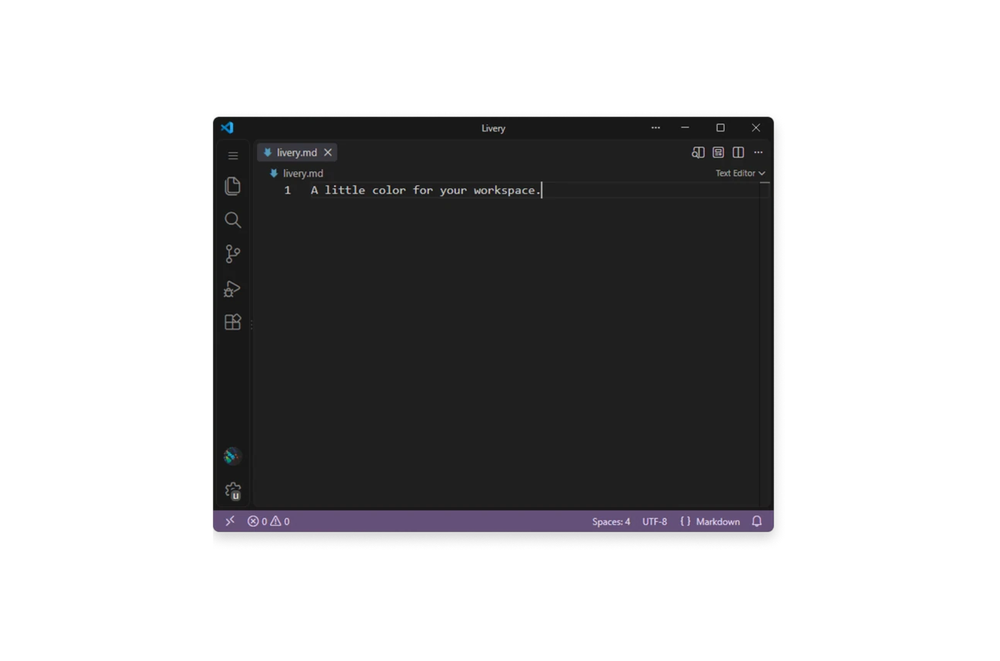

# Livery

A little color for each VS Code workspace, so you can tell projects apart at a glance.

**Livery** adds a colored status bar with readable, subtly tinted text that feels at home in VS Code's modern layout.

Open the Command Palette (`F1` / `Ctrl+Shift+P` / `Cmd+Shift+P`) and run **Livery: Choose Color**. Pick a preset or your own color, with a live preview.

Try **Livery: Random Color** for inspiration, or **Livery: Reset** to clear it. Colors are saved per workspace.
